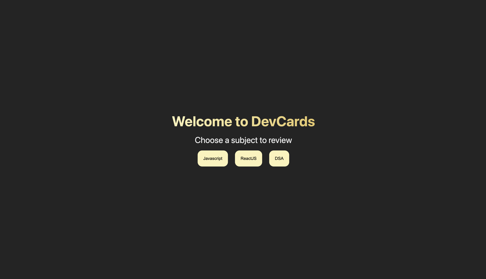

# DevCards: Interactive Flashcards for Developers 👩🏽‍💻



## 📝 About The Project

DevCards is an interactive flashcard application built to help developers study and review key concepts in JavaScript, React, and Data Structures & Algorithms (DSA). This project was created as part of my CodePath Web Development 102 course and enhanced with additional features.

### ✨ Features

- **Topic Selection**: Choose from three development topics to study

  - JavaScript fundamentals
  - React concepts and hooks
  - Data Structures & Algorithms

- **Interactive Flashcards**: Flip cards to reveal answers

  - Navigate through questions with arrow controls
  - Shuffle functionality for randomized study sessions

- **Self-Assessment**: Type your answers before revealing the solution

  - Receive immediate feedback on your responses
  - Track your current and longest streaks

- **Responsive Design**: Fully responsive layout that works across all device sizes

## 🌐 Live Demo

[View Live Demo](https://clever-cat-6d2a65.netlify.app/)

## 🛠️ Built With

- React.js
- CSS Modules
- JavaScript

## 📊 Project Structure

```
devcards/
├── src/
│   ├── components/
│   │   ├── Flashcard/
│   │   │   ├── Flashcard.jsx
│   │   │   └── Flashcard.module.css
│   │   └── Landing/
│   │       ├── landing.jsx
│   │       └── landing.module.css
│   ├── data.js         # Flashcard content for all topics
│   ├── App.jsx         # Main component with routing logic
│   ├── App.module.css  # Styles for App component
│   ├── main.jsx        # Entry point
│   └── index.css       # Global styles and variables
└── ...
```

## 🎯 Learning Objectives

This project demonstrates:

- React component architecture
- State management with React Hooks
- Conditional rendering
- Event handling in React
- CSS Modules for component-scoped styling
- Responsive design principles
- Data organization and management

## 🔍 How It Works

1. **Landing Page**: Users are greeted with a welcome screen and can select a topic to study.
2. **Flashcard Interface**: Once a topic is selected, users can navigate through flashcards with questions related to that topic.
3. **Answer Checking**: Users can type their answers in the provided text area and check them against the correct answer.
4. **Feedback System**: The application provides immediate feedback on users' answers and tracks their performance with a streak counter.

## 🛣️ Future Enhancements

- [ ] API integration for dynamic content instead of hard-coded data
- [ ] Custom flashcard creation
- [ ] Additional topics (Node.js, TypeScript, etc.)
- [ ] Spaced repetition learning algorithm
- [ ] Export/import flashcard decks

## 🙏 Acknowledgments

- [CodePath](https://www.codepath.org/) for providing the learning opportunity
- All the instructors and TFs who provided guidance

---

Feel free to reach out with feedback or suggestions as I continue to learn and improve my development skills 🎊👩🏽‍💻🙌🏾!

---

Happy learning n coding! 🚀📚🧠👩🏽‍💻💫
